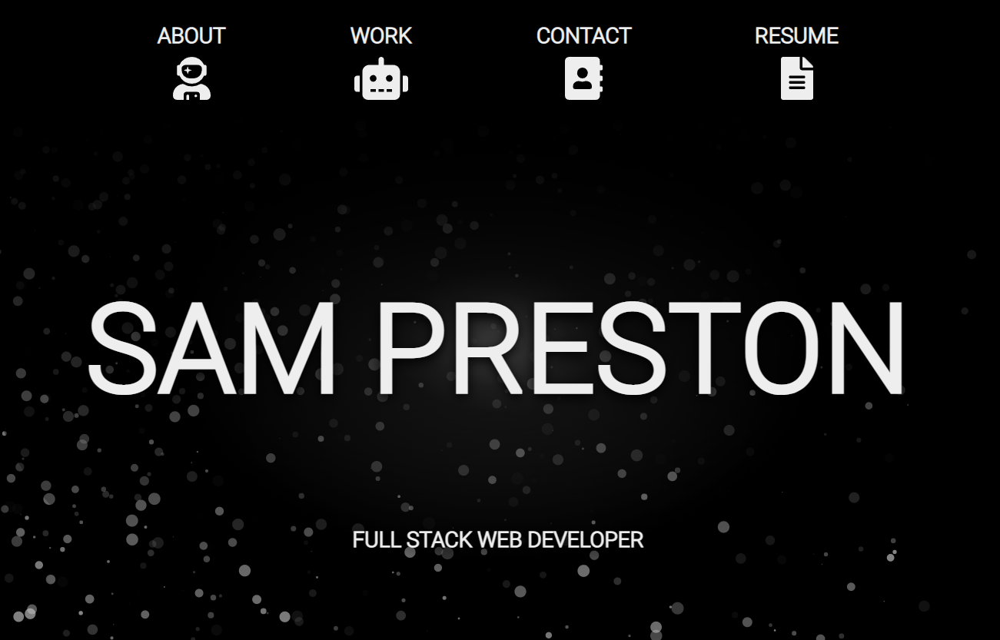

# Sam Preston Portfolio

## Description

Hi! Thanks for checking out my portfolio. I have recently finished up a certificate from the University of Washington's Full Stack Web Development Bootcamp and am starting to transtion into web development as a career. I built this portfoio to showcase my work and talents. From the deployed site, you can find links to my recent work, and view my resume. Come learn a little bit more about me!

[Deployed Portfolio](https://spreston4.github.io/)

## Technologies Used

Built in Visual Studio with:
* jQuery / Javascript
* HTML
* CSS

## Contact Me

Contact me via e-mail, or check out my GitHub!

* GitHub: [spreston4](https://github.com/spreston4)
* E-mail: [sam.preston11@gmail.com](mailto:sam.preston11@gmail.com)

